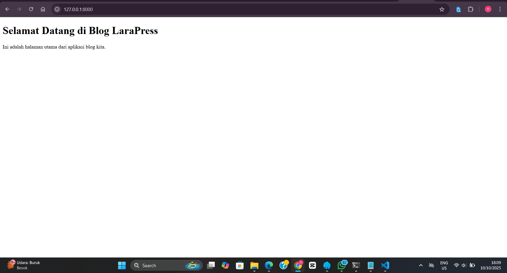
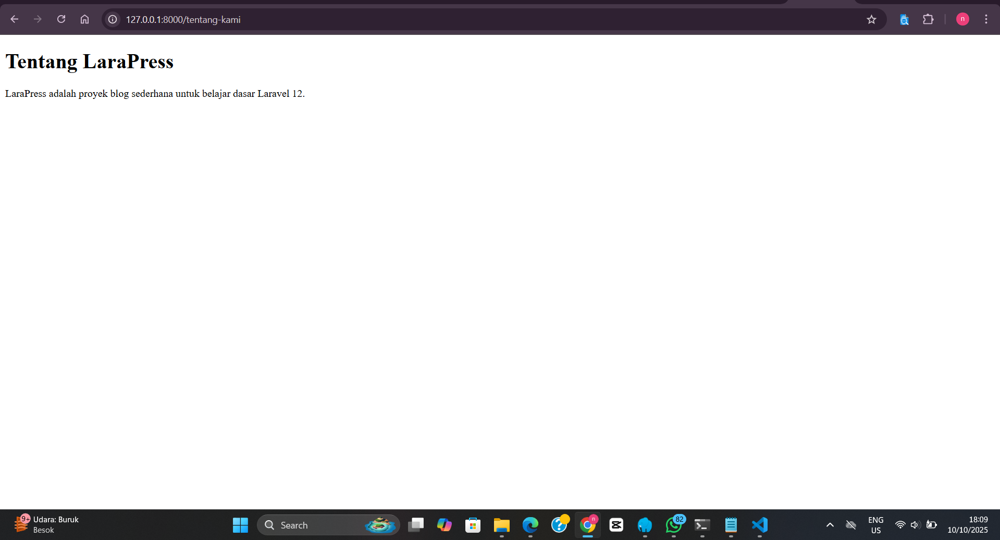
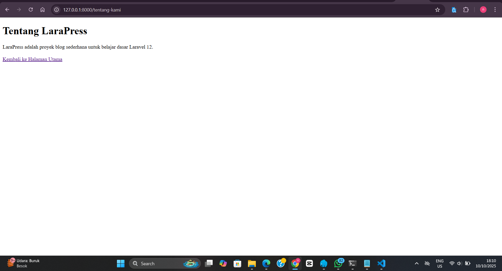
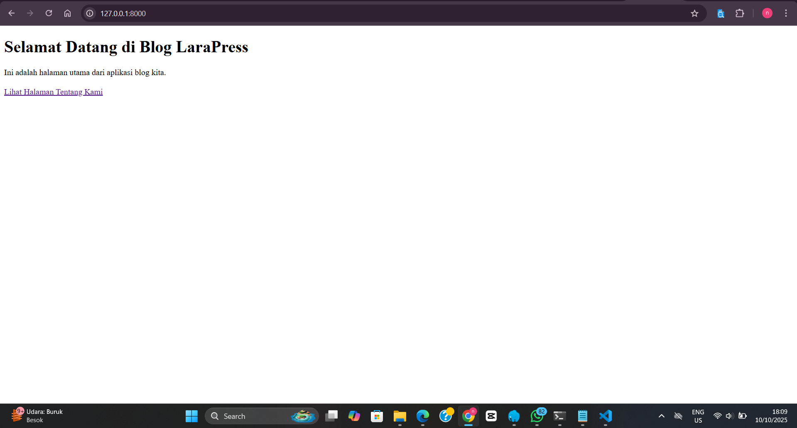
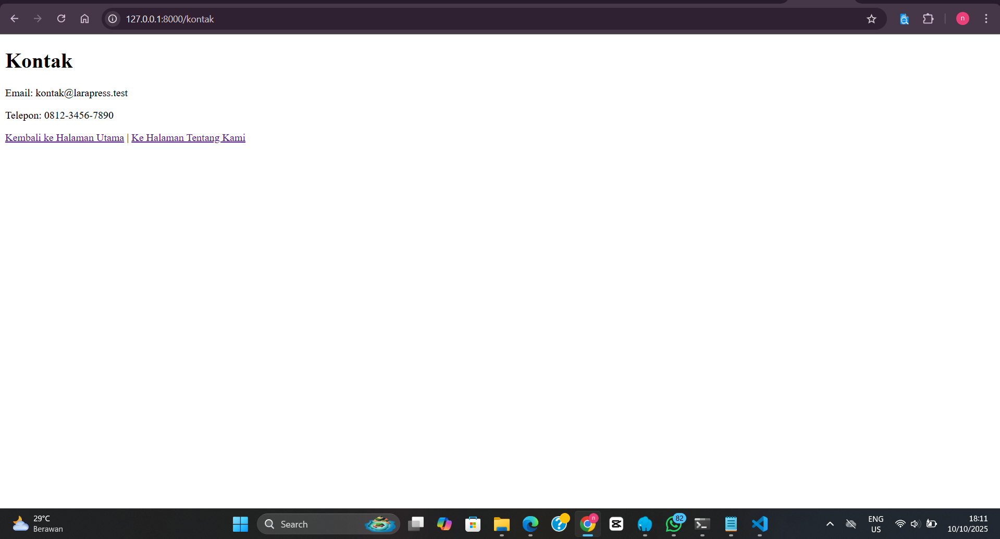
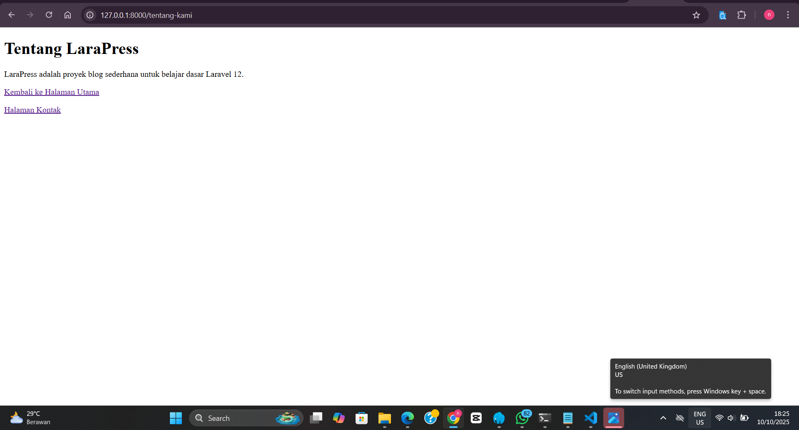
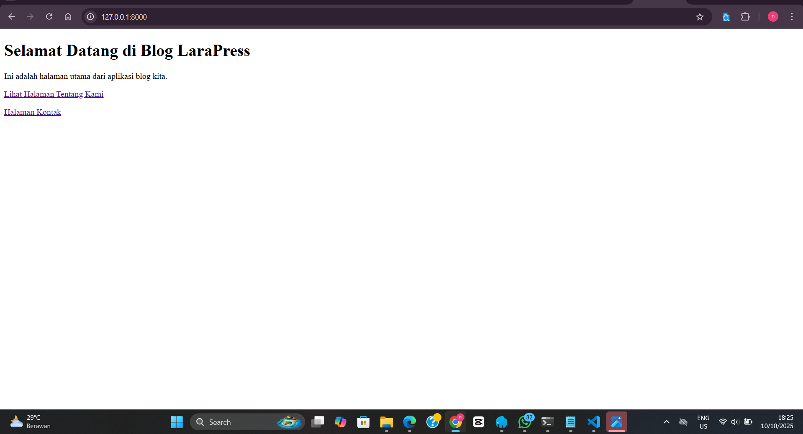

# Pertemuan 3 - Materi Praktikum Laravel: Pertemuan 1 
Judul Praktikum: Instalasi, Konfigurasi, dan Halaman Pertama Kita 
Pertemuan: 1 dari 10 

## Identitas Diri
- **Nama : Nenden Nuraini**
- **NPM  : 4523210144**

## Deskripsi
Proyek: "LaraPress" (Aplikasi Blog Sederhana) 
Tujuan Pembelajaran: 
Setelah menyelesaikan praktikum ini, mahasiswa diharapkan mampu: 
1. Menginstal proyek Laravel 12 baru menggunakan Composer. 
2. Menjalankan server development lokal menggunakan php artisan serve. 
3. Memahami struktur folder esensial untuk memulai. 
4. Mendefinisikan rute (Route) sederhana di routes/web.php. 
5. Membuat dan memodifikasi file tampilan (View) menggunakan Blade. 
6. Memahami alur kerja fundamental Laravel: Request -> Route -> View -> Response. 
 
## Tampilan Aplikasi 
 
**Tampilan Awal** 
 
 
**Tampilan Halaman Tentang kami** 

 
**Menambahkan Link Navigasi Dikedua Halaman** 
 
 
 
**Menambahkan Link Navigasi Dikedua Halaman** 
 

**Tugas Mandiri (10 Menit)** 

Untuk memastikan Kita memahami konsepnya, kerjakan tugas kecil berikut: 
1. Buat satu halaman statis baru bernama "Kontak". 
2. Halaman ini harus bisa diakses melalui URL /kontak. 
3. Isi halaman tersebut dengan informasi kontak fiktif (misal: email dan nomor telepon). 
4. Jangan lupa tambahkan link navigasi ke dan dari halaman "Kontak" di halaman lainnya.

Tampilannya sebagai berikut
 
 
 